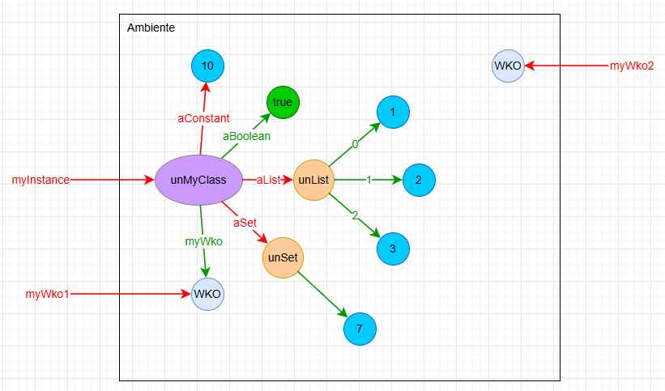
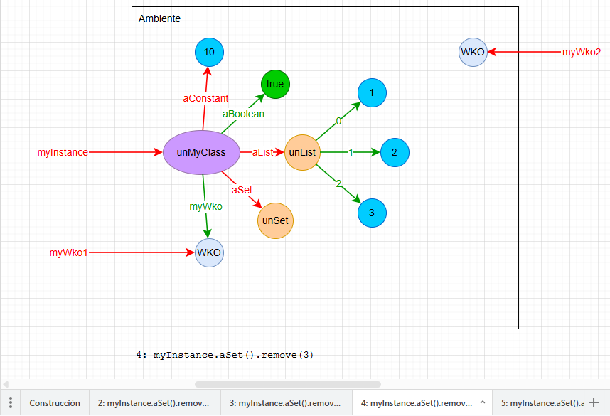
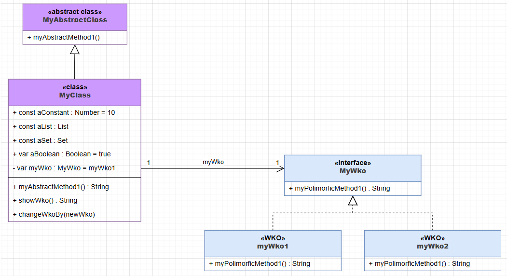

# Wollok diagrams tools

Automatically generates Dynamic and Static Diagrams from Wollok code.
 - [More information in English](tools/docs/README-en.md).
 - [Más información en Español](tools/docs/README-es.md).

## Example source code

File `example.wlk`:
```
object myWko1 {
    method myPolimorficMethod1(){
        return "myWko1"
    }
}

object myWko2 {
    method myPolimorficMethod1(){
        return "myWko2"
    }
}

class MyAbstractClass {
    method myAbstractMethod1()
}

class MyClass inherits MyAbstractClass {
    const property aConstant = 10
    const property aList = [1,2,3]
    const property aSet = #{1,2,3,3}
    var property aBoolean = true
    var myWko = myWko1
    override method myAbstractMethod1(){
        return "Implemented"
    }
    method showWko(){
        return myWko.myPolimorficMethod1()
    }
    method changeWkoBy(newWko){
        myWko = newWko
    }
}
```

File `example.wrepl`:
```
const myInstance = new MyClass()
myInstance.aSet().remove(1)
myInstance.aSet().remove(2)
myInstance.aSet().remove(3)
myInstance.aSet().add(7)
```

## Automatic generated Dynamic Diagram:

Draw.io format:



## Automatic generated Dynamic Diagrams (sequence):

Draw.io format:



## Automatic generated Static Diagram:

Draw.io format:

