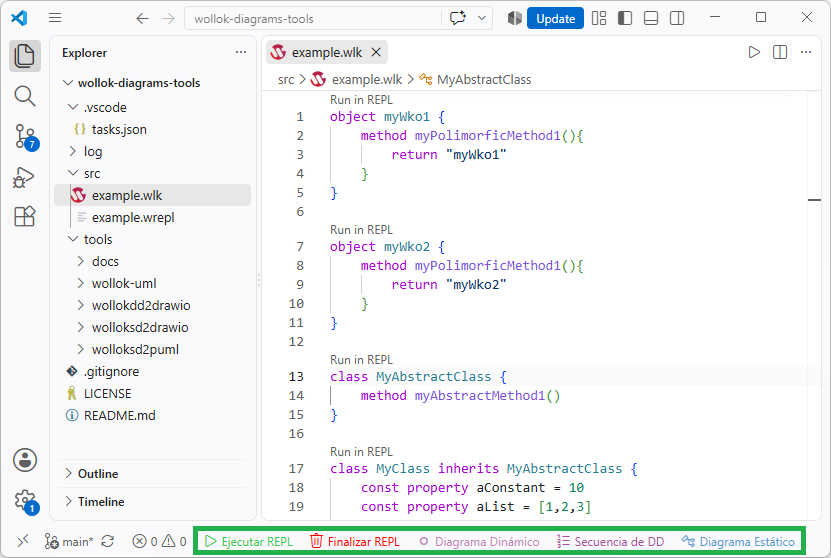

# Tools for generating diagrams from Wollok code

The following tools were developed to generate:
1. **Dynamic Diagram** (objects and references), derived from program execution.
2. **Static Diagram** (classes, WKOs, and their design relationships), derived from analyzing the code structure. Output formats include:
- Draw.io (`.drawio`)
- PlantUML (`.puml`)

| Tool | Function |
|---|---|
| `wollokdd2drawio` | Takes a `.wlk` file and —if present— a `.wrepl` file (a custom file containing a program sequence one would run in the REPL) and executes them to generate a **Dynamic Diagram** in `.drawio` format. It can generate a single diagram showing a "snapshot of the entire environment" after full execution, or—by adding the `--genseq` argument—generate multiple pages showing the step-by-step execution of each line, grouping lines related to object creation on the same page. |
| `wolloksd2drawio` | Generates a **Static Diagram** in `.drawio` format from a `.wlk` file. If the diagram is manually modified and the tool is run again to regenerate it, **manually adjusted positions are preserved**. |
| `wolloksd2puml` | Generates a **Static Diagram** in `.puml` format from a `.wlk` file. This diagram is text-based and handles Git diffs well. This format was used in some Wollok course notes. | 

## Common execution options

```
-o, --output <file>     output file (default: stdout)
-c, --config <file>     sidecar .uml.json file
-t, --title <text>      diagram title
--associations <mode>  both (default) | arrow | attribute
--no-attributes        do not show attributes
--no-operations        do not show methods
--no-mutability        do not show const/var
--include-tests        include .wtest and .wpgm
-q, --quiet                do not show warnings
--enlang               messages in English (default)
--eslang               messages in Spanish (also --esinclusivelang and --esgenderlang)
```

`--associations` determines whether a reference to another entity appears as an attribute
inside the box, as an arrow, or as both (which is the style we have been
using in the course).

Messages —warnings, errors, the summary of what was generated, the `--help` text, the
`Generated by...` header written inside the files, and what each arrow of the class
diagram says (`<inherits>`, `<knows>`...)— are in English by default, and in
Spanish with any `--es...` flag (`--eslang`, `--esinclusivelang`, `--esgenderlang`; in the
tools that don't draw instances the three are equivalent).

Each tool adds its own specific options: see its README. 

## Architecture

General concept:

```
DYNAMIC DIAGRAM (code execution)

.wlk ──┐
       ├──► Interpreter ──► live environment ──► objects ──► object model ──► .drawio
.wrepl ┘                     (frame.locals)                    (wollokdd2drawio)


STATIC DIAGRAM (code reading)

.wlk ──► wollok-ts ──► AST ──► extract ──► UML model ──┬──► render PlantUML ──► .puml
                                                       │
                                                       └──► render draw.io ──► .drawio
```

File and folder structure and their purpose:

```
tools/
├── wollok-uml/            the core, independent of the output format, used by the following 3 folders
│   ├── extract.mjs        AST → CLASS model (entities, attributes, relationships)
│   ├── objects.mjs        .wrepl execution → OBJECT model
│   ├── infer.mjs          type inference (Wollok does not declare them)
│   ├── annotations.mjs    reading @Uml... annotations
│   ├── entities.mjs       classes/objects in an environment, with their source file
│   ├── config.mjs         loads the .uml.json sidecar if it exists
│   ├── sources.mjs        searching for and reading .wlk files
│   ├── drawio-merge.mjs   positions from the previous .drawio (used by both .drawio generators)
│   ├── text-width.mjs     how wide a text is in draw.io's font (sizes the class boxes)
│   ├── wollok.mjs         source of wollok-ts
│   ├── i18n.mjs           language of the messages (English, or Spanish with --es...)
│   └── generator.mjs      common workflow and command-line options
├── wollokdd2drawio/       cli.mjs + render.mjs + layout.mjs + colors.mjs
├── wolloksd2drawio/       cli.mjs + render.mjs + layout.mjs
└── wolloksd2puml/         cli.mjs + render.mjs
```

The intermediate model is a flat object (`{ entities, interfaces, relations,
notes, warnings }`), so adding a third format simply means writing another `render`
function and a short `cli.mjs` file—none of the existing code needs to be touched.

## How they work

None of them parse text manually; they use **`wollok-ts`**—the same parser used by
the Wollok IDE and CLI—so they see the exact same AST as the interpreter.
`wollokdd2drawio` goes a step further by also using the **interpreter**: an object
diagram cannot be deduced just by reading the code; the code must be executed.

## Type inference, polymorphic groups, and relationships

Wollok does not use explicit type declarations, so types are inferred. In order
from strongest to weakest:

1. If present: The `@UmlType` / `@UmlReturns` annotation.
2. If present: The `types` dictionary in the `.uml.json` sidecar file.
3. Code structure:
- literals (`100` → `Number`, `[]` → `List`, `"x"` → `String`); 
- `new Cammera()` → `Cammera`; 
- known messages (`.size()` → `Number`, `.isEmpty()` → `Boolean`,
`>` `and` `not` → `Boolean`, `*` `-` → `Number`, `.map()` → `List`); 
- `self.otherMethod()` → whatever that method returns.
4. Name heuristic: `pertenencia` → `Pertenencia`, `unaMedida` → `Medida`
(it drops the article and the plural). And if no entity has that name, a name
about a **quantity or a unit**, in Spanish or English, is a `Number`: `km`,
`litros`, `hours`, `unosSegundos`, `unaCantidad`, `cantidadDeColores`,
`colorCount`. It doesn't apply when the name starts by saying something else
(`listaDeHoras`, `isOld`, `nombreDelMes`), nor to the plural of a measure
(`prices` is a list).

## VSCode Integration

First, install the `Taks` extension, which allows you to see the following buttons in the status bar:



These buttons operate on **the `<file>.wlk` currently open and in focus in the editor**.

| Button | Action Performed |
|---|---|
| **Run REPL** | Runs the `<file>.wlk` in a Wollok REPL terminal and opens the Dynamic Diagram in the editor |
| **End REPL** | Closes the REPL terminal process and the tab currently in focus in the editor (usually the Dynamic Diagram, unless changed) |
| **Dynamic Diagram** | `wollokdd2drawio`, which generates a `<file>_dynamic.drawio` |
| **Dynamic Diagram** | `wollokdd2drawio`, which generates a `<file>_dynamic.drawio` |
| **DD Sequence** | `wollokdd2drawio --genseq`, which generates a `<file>_dynamic_seq.drawio` |
| **Static Diagram** | `wolloksd2drawio`, to generate a `<file>_static.drawio` |

The buttons that generate diagram files create them in the same location as the `.wlk` source code file.

To understand how these buttons are defined, see the [`.vscode/tasks.json`](../../.vscode/tasks.json) file.

Additionally, the *Tasks: Run Task* menu offers standalone variants (generating PlantUML),
versions with `--relayout` (which discard manual positioning and recalculate the layout), and more.
