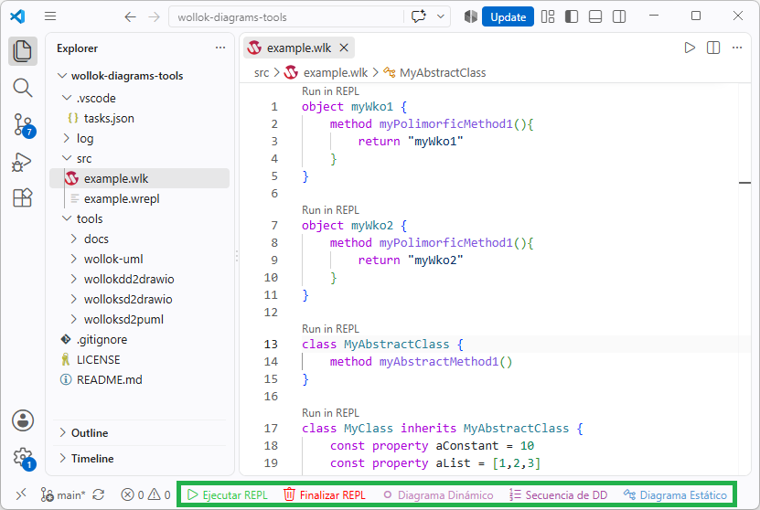

# Herramientas para generar diagramas a partir de código Wollok

Se desarrollaron las siguientes herramientas para generar : 
1. **Diagrama Dinámico** (objetos y referencias), que sale de ejecutar el programa.
2. **Diagramá Estático** (clases, wko y sus relaciones de diseño), que sale de revisar la estructura del código. Con salidas en formatos:
    - Draw.io `.drawio`
    - PlantUML `.puml`

| Herramienta | Que hace |
|---|---|
| `wollokdd2drawio` | A partir de un archivo `.wlk` y si existe, un archivo `.wrepl` (archivo inventado que contiene una secuencia de programa que uno correría en el REPL) los ejecuta para generar un **Diagrama Dinámico** en formato `.drawio`. Permite generar un único diagrama mostrando "la foto del ambiente completo" al ejecutar todo, o agregando el argumento `--genseq`, genera múltiples páginas con el paso a paso de la ejecución de cada línea, agurpando líneas de código que tengan que ver con la creación de objetos en la misma página. |
| `wolloksd2drawio` | Mediante de un archivo `.wlk` genera un **Diagrama Estático** en formato `.drawio`. Si luego se modifica manualmente y se intenta regenerar ejecutando esta herramienta **se mantiene las posiciones que se modificaron manualmente**. |
| `wolloksd2puml` | Usando de un archivo `.wlk` genera un **Diagrama Estático** en formato `.puml`. Este diagrama es texto y diffea bien en git. Este fomato se usó en algunos de los apuntes de Wollok. |

## Opciones comunes al ejecutarlas

```
-o, --output <archivo>     archivo de salida (por defecto: stdout)
-c, --config <archivo>     sidecar .uml.json
-t, --title <texto>        título del diagrama
    --associations <modo>  both (por defecto) | arrow | attribute
    --no-attributes        no mostrar atributos
    --no-operations        no mostrar métodos
    --no-mutability        no mostrar const/var
    --include-tests        incluir .wtest y .wpgm
-q, --quiet                no mostrar advertencias
```

`--associations` decide si una referencia a otra entidad se ve como atributo
dentro de la caja, como flecha, o como las dos cosas (que es lo que veníamos
usando en la materia).

Cada herramienta agrega las suyas: ver su README.

## Arquitectura

Idea general:

```
  DIAGRAMA DINÁMICO (se ejecuta el código)

  .wlk ──┐
         ├──► Interpreter ──► ambiente vivo ──► objects ──► modelo de objetos ──► .drawio
  .wrepl ┘                     (frame.locals)                  (wollokdd2drawio)


  DIAGRAMA ESÁTICO (se lee el código)

  .wlk ──► wollok-ts ──► AST ──► extract ──► modelo UML ──┬──► render PlantUML ──► .puml
                                                          │
                                                          └──► render draw.io ──► .drawio
```

Estructura de archivos y carpetas y su porpósito:

```
tools/
├── wollok-uml/            el núcleo, independiente del formato de salida, lo usan las 3 carpetas siguientes
│   ├── extract.mjs        AST → modelo de CLASES (entidades, atributos, relaciones)
│   ├── objects.mjs        ejecución del .wrepl → modelo de OBJETOS
│   ├── infer.mjs          inferencia de tipos (Wollok no los declara)
│   ├── annotations.mjs    lectura de las anotaciones @Uml...
│   ├── entities.mjs       las clases/objetos de un entorno, con su archivo
│   ├── config.mjs         si existe, carga el sidecar .uml.json
│   ├── sources.mjs        búsqueda y lectura de los .wlk
│   ├── drawio-merge.mjs   posiciones del .drawio anterior (lo usan los dos que generan .drawio)
│   ├── wollok.mjs         de dónde sale wollok-ts
│   └── generator.mjs      el flujo común y las opciones de línea de comandos
├── wollokdd2drawio/       cli.mjs + render.mjs + layout.mjs + colors.mjs
├── wolloksd2drawio/       cli.mjs + render.mjs + layout.mjs
└── wolloksd2puml/         cli.mjs + render.mjs 
```

El modelo intermedio es un objeto plano (`{ entities, interfaces, relations,
notes, warnings }`), así que agregar un tercer formato es escribir otro `render`
y un `cli.mjs` de pocas líneas: no se toca nada de lo demás. 

## Cómo funcionan

Ninguna parsea texto a mano: usan **`wollok-ts`**, el mismo parser que usan el
IDE y el CLI de Wollok, así que ven exactamente el mismo AST que el intérprete.
`wollokdd2drawio` va un paso más allá y usa también su **intérprete**: un diagrama de
objetos no se puede deducir leyendo el código, hay que correrlo.

## Inferencia de tipos, grupos polimórcos y relacions

Wollok no declara tipos, así que se deducen. De más fuerte a más débil:

1. Si existe: La anotación `@UmlType` / `@UmlReturns`.
2. Si existe: El diccionario `types` del archivo sidecar `.uml.json`.
3. La estructura del código:
   - literales (`100` → `Number`, `[]` → `List`, `"x"` → `String`);
   - `new Camara()` → `Camara`;
   - mensajes conocidos (`.size()` → `Number`, `.isEmpty()` → `Boolean`,
     `>` `and` `not` → `Boolean`, `*` `-` → `Number`, `.map()` → `List`);
   - `self.otroMetodo()` → lo que devuelva ese método (con corte de recursión);
   - una referencia a un WKO vale por lo que ese WKO **implementa**: como
     `principiante` declara `@UmlImplements(interface = "Nivel")`, el campo
     `var nivel = principiante` sale tipado `Nivel` y no `principiante`;
   - el tipo de elemento de una colección vacía se busca en los `add` de los
     métodos: `botin.add(pertenencia)` → `List<Pertenencia>`.
4. Heurística por nombre: `pertenencia` → `Pertenencia`, `unaMedida` → `Medida`
   (saca el artículo y el plural).

Un método sin `return` es un comando y se dibuja sin tipo de retorno.

**Lo que no se pudo deducir se reporta al final**, para saber exactamente dónde
conviene editar:

```
5 cosa(s) que no pude deducir del codigo:
  - Pertenencia.dificultadBasica: no pude inferir el tipo (usa @UmlType o el diccionario "types")
```

## Integración en VSCode

Primero instala la extensión `Taks`, que permitira ver los sigueintes botones en la status bar:



Estos botones actuan sobre **el \<archivo\>.wlk que tenés abierto y en foco en el editor**.

| Botón | Qué ejecuta |
|---|---|
| **Ejecutar REPL** | Ejecuta el `<archivo>.wlk` en una Terminal REPL de Wollok y abre el Diagrama Dinámico en el editor |
| **Finalizar REPL** | Cierra proceso de la terminal del REPL y la pestaña en foco en el editor (que normalmente será el Diagrama Dinámico si no se cambió) |
| **Diagrama Dinámico** | `wrepl2drawio`, que genera un `<archivo>_dynamic.drawio` |
| **Diagrama Dinámico** | `wrepl2drawio`, que genera un `<archivo>_dynamic.drawio` |
| **Secuencia de DD** | `wrepl2drawio --genseq`, el cual genera un `<archivo>_dynamic_seq.drawio` |
| **Diagrama Estático** | `wollok2drawio`, para generar un `<archivo>_static.drawio` |

Los botones que generan los archivos de los diagramas, los generan en la misma ubicación del archivo de código fuente `.wlk`.

Para comprender como se definene estos botones, ver el archivo [`.vscode/tasks.json`](../../.vscode/tasks.json).

Además, desde *Tareas: Ejecutar tarea* existen las variantes sueltas (generar PlantUML),
las de `--relayout` (que descartan el acomodado manualo y recalculan el layout) y más.

